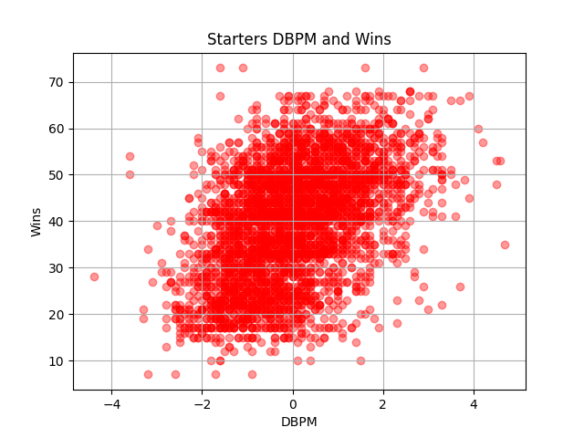
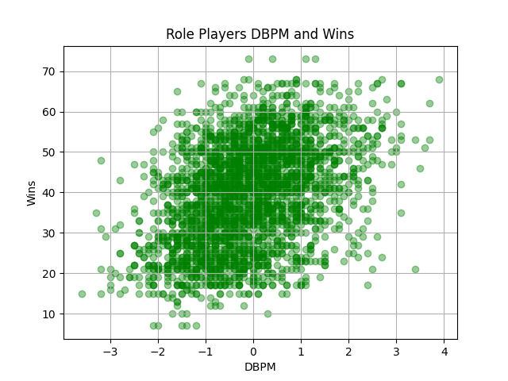
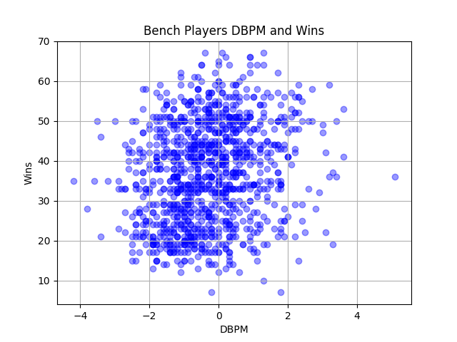

# Insight 1 – DBPM (Defense) and Wins by Player Role

### Type of Finding
This finding is both statistical and visual. The scatterplots show how defensive box plus/minus (DBPM) values spread across starters, role players, and bench players, while the analysis highlights how each group’s defensive impact relates to team wins.

### Connection to the Hypothesis:
My hypothesis emphasizes that role players the “quiet stars” are critical to team success. By looking at defense

 
Starters have a clear defensive influence, and stronger DBPM values are strongly tied to more wins.

 
Role players show a noticeable positive relationship. While not as strong as the starters, their impact is meaningful and supports the idea that quiet stars make a difference.

 
Bench players display only a weak connection between defense and wins, suggesting their defensive influence does not translate as clearly to team outcomes.

### Why It Matters:
These results highlight the value of role players. Starters may anchor a team’s defense, but role players add steady contributions that can tip close games and strengthen overall team performance. Teams that cultivate reliable quiet stars gain an important competitive edge.

## Overview:
Defensive contributions from role players show a positive link to winning, though weaker than starters. Bench players have little measurable effect. This provides partial support for the hypothesis that quiet stars help contribute in ways that improve their team's success.

## To-do 
Calculate the Correlation of Coefficients between DBPM and Wins for each role. should help strength and direction of the relationship.