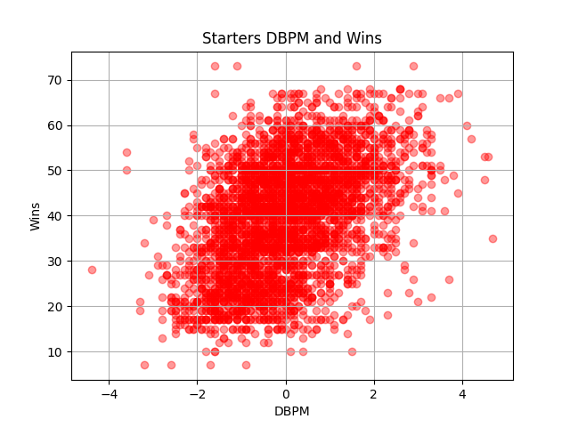
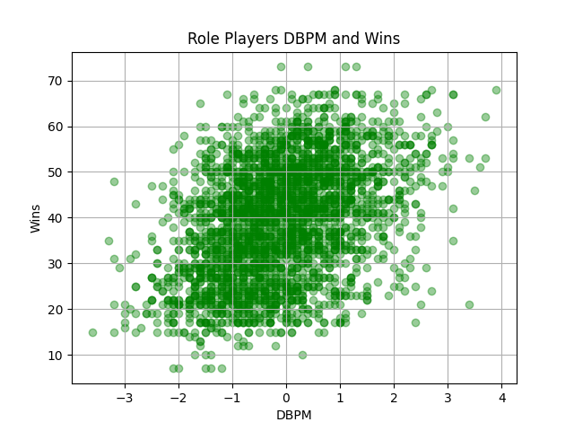
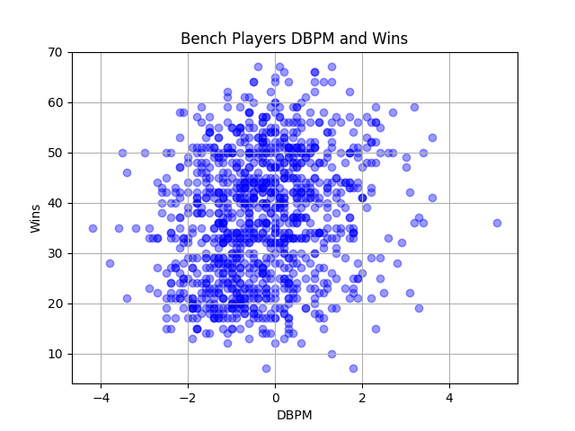

# Insight 1 – DBPM (Defense) and Wins by Player Role

### Type of Finding
This finding is both statistical and visual. The scatterplots show how defensive box plus/minus (DBPM) values spread across starters, role players, and bench players, while the analysis highlights how each group’s defensive impact relates to team wins.

---

### Connection to the Hypothesis:
My hypothesis emphasizes that role players the “quiet stars” are critical to team success. By looking at defense

  
The above scatterplot shows starters have a clear defensive influence. The correlation between DBPM and wins is r = 0.450, showing a moderate positive relationship. Teams with starters who have stronger defensive ratings tend to win more games.
 

  
The above scatterplot shows role players have a noticeable positive relationship. The correlation is r = 0.396, also a moderate positive relationship. Teams with higher-defense role players while not as strong of a relationship as the starters wins are noticeably more, directly supporting the idea that quiet stars help drive success.
 

  
The above scatterplot shows bench players have a weak connection between defense and wins. The correlation drops to r = 0.204, indicating only a weak relationship between bench defense and team wins. This suggests that their defensive influence does not translate as clearly to teams winning.
 

When grouping DBPM into performance ranges, the trend is a little more clear:

| DBPM Range | Avg Wins – Starters | Avg Wins – Role Players | Avg Wins – Bench Players |
| ---------- | ------------------- | ----------------------- | ------------------------ |
| < -2       | 27.3                | 27.3                    | 33.1                     |
| -2 to 0    | 36.1                | 36.7                    | 35.6                     |
| 0 to 2     | 44.0                | 43.9                    | 39.4                     |
| 2+         | 49.6                | 48.3                    | 42.7                     |

Teams with role players posting DBPM above 0 average roughly 7–12 more wins than teams with below-average defenders. This pattern mirrors that of starters, just slightly lower in magnitude, which reinforces that strong defensive role players (the quiet stars) make a measurable difference.

---

## Why It Matters:
This insight gives statistical proof that role players contribute meaningfully to winning, especially on the defensive side. While starters are the most impactful, role players defensive consistency is what separates good teams from great ones. This supports the hypothesis that a team’s success is shaped not only by its starters, but by the quiet stars, efficient defenders who fill vital roles around them.

