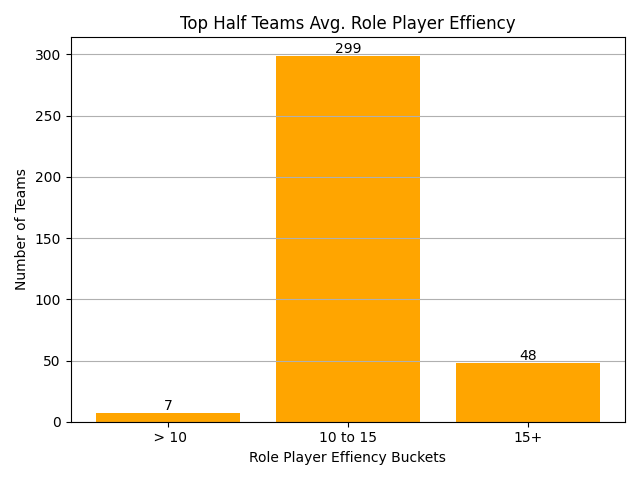
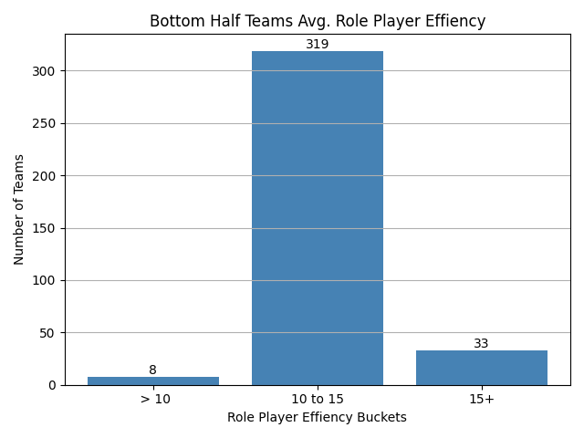

# Insight 2 – Role Player Efficiency (PER) and Team Success

## Type of Finding:
This is a statistical and visualization finding. The bar charts show how often teams fall into certain efficiency ranges for role players, and the analysis highlights the differences between teams in the top half of the standings versus the bottom half.

## Connection to the Hypothesis:
The hypothesis states that role players, the “quiet stars,” are key drivers of team success. 

Looking at the charts:

  

Top Half Teams: These teams also cluster around the 10–15 PER range, however there is a noticeably higher count of role players in the 15+ efficiency bucket compared to the bottom half

  

Bottom Half Teams: The vast majority of these teams have role players with average efficiency ratings in the 10–15 range. Very few teams have highly efficient role players.

This shows that while most teams rely on average role players, the teams that consistently land in the top half are the ones that have role players performing above average. That supports the hypothesis by showing that “quiet stars” with higher efficiency ratings give their teams a measurable edge.

To validate these visual findings, a statistical comparison was run between top-half and bottom-half teams.

Mean PER Comparison:
Role players on top-half teams averaged a PER of 13.30, compared to 12.87 for bottom-half teams.

Proportion Test (Chi-Square):
13.8% of role players on top-half teams (49 of 355) had PER ratings above 15, compared to 9.2% (33 of 360) on bottom-half teams.
The Chi-Square test returned p = 0.0676, slightly above the 0.05 significance level.

While the result is not statistically significant at the 95% confidence level, the directional trend aligns with the visual data—top-half teams have a higher share of efficient role players. This supports the hypothesis that the presence of “quiet stars” offers a tangible, if subtle, advantage in overall team performance.

Teams in the top half of the standings have more role players with efficiency ratings (PER) above 15 compared to bottom half teams. This supports the hypothesis by showing that efficient role players the “quiet stars” give their teams an edge in winning.

## Why It Matters:
This insight highlights how efficiency separates average teams from successful ones. Having role players who perform at or above league average efficiency is often what pushes a team into the top half of the standings, reinforcing the idea that the quiet stars play a real role in winning.

