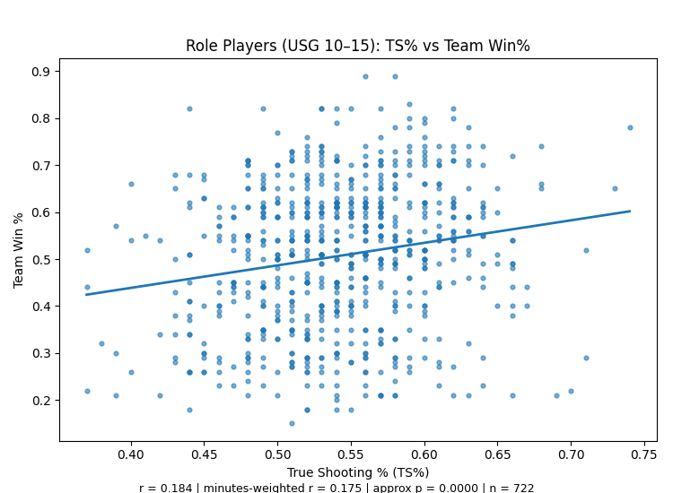
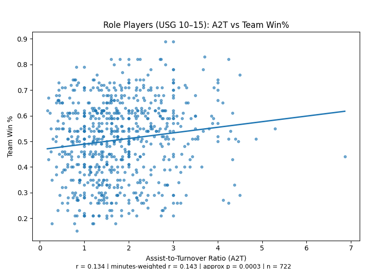

# Insight 4: Bench Efficiency and Team Success

## Type of Finding:
This finding is both statistical and visual. Focusing on role players (usage 10–15%) and how True Shooting % (TS%) and Assist-to-Turnover ratio (A2T) relate to team win percentage.

---

### Details

Method: Player-season level correlations (plain and minutes-weighted), plus scatterplots with an unweighted trend line.

Overall results

| Metric |	Mean  | Median | IQR   | r vs Team Win % | r (minutes-weighted) |  n  |
|--------|--------|--------|-------|-----------------|----------------------|-----|
| TS%	 |  0.542 | 0.540  | 0.080 | +0.184	         | +0.175	            | 722 |
| A2T	 |  1.802 | 1.645  | 1.190 | +0.134	         | +0.143	            | 722 |

For low-usage role players, higher TS% and higher A2T are modestly associated with higher team win %.

The minutes-weighted correlations are very similar to the plain ones, suggesting the signal holds for players who play more minutes.

Approximate p-values (from your plots) are small, indicating these relationships are unlikely to be due to chance given the sample size. (They speak to reliability, while the correlation values show effect size.)

---

## Why It Matters:

TS% (finishing efficiency) and A2T (possession value) from low-usage role players both show positive correlations with team win %.
The signal persists when weighting by minutes, indicating the relationship holds most for role players who actually see the floor.
